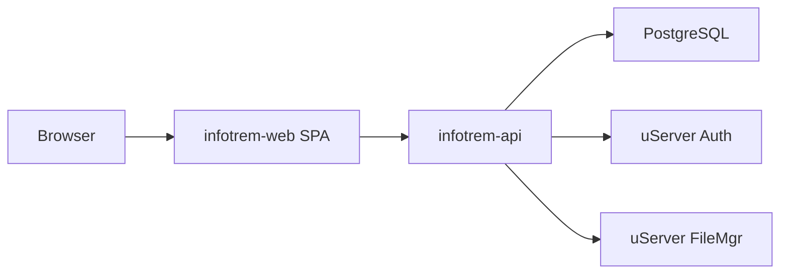
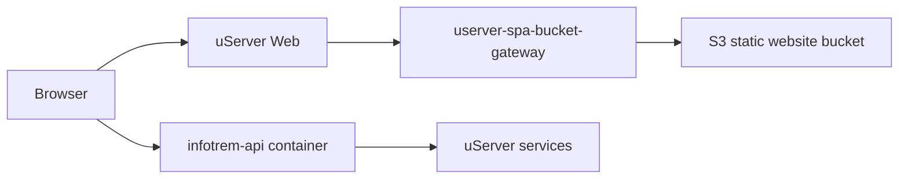

# Architecture

## Repository Boundaries

The root `infotrem` repository coordinates the InfoTrem system. It does not own
the frontend or backend source directly; those live in submodules:

- `infotrem-web`: browser SPA and frontend tests.
- `infotrem-api`: HTTP API, database migrations, fixtures, and API tests.

Root files document how the parts fit together and provide convenience commands
for local development and integration smoke testing.

## Runtime Shape

During local development, Vite serves the SPA and proxies `/api/*` requests to
the local API. The API uses its own Docker Compose file for local Postgres and
expects uServer services to already be reachable.

## Production Shape

In production, `infotrem-web` is built to static assets and uploaded to an S3
website bucket. `userver-spa-bucket-gateway` maps public hostnames to bucket
website endpoints, while TLS and outer reverse proxy behavior remain with
`userver-web`.

The API is deployed as a container in the uServer ecosystem. It exposes
`GET /health` and serves OpenAPI data at `/docs/swagger.json`.

## Data Boundary

Raw documents in `_docs/_to_be_converted_to_fixtures/` are source material for a
future ingestion pipeline. They are not runtime dependencies yet. Derived
fixtures should be generated only after the target schema and ingestion process
are defined.
