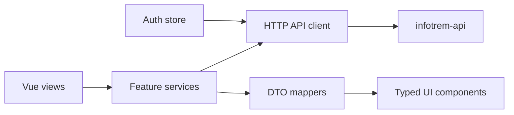

# Frontend Backend Parity

This document maps the current `infotrem-api` feature surface to the current
`infotrem-web` app and proposes a phased implementation plan to make backend
features available in the frontend.

## Sources Reviewed

Backend:

- `infotrem-api/README.md`
- `infotrem-api/AGENTS.md`
- `infotrem-api/internal/controllers/routes/domain_mount.go`
- `infotrem-api/internal/controllers/routes/crud_handlers.go`
- `infotrem-api/internal/controllers/routes/domain_*.go`
- `infotrem-api/internal/authn/*.go`
- `infotrem-api/internal/store/read_policy.go`
- `infotrem-api/internal/store/table_policy.go`
- `infotrem-api/migrations/000001_initial_schema.up.sql`

Frontend:

- `infotrem-web/README.md`
- `infotrem-web/AGENTS.md`
- `infotrem-web/docs/architecture.md`
- `infotrem-web/src/router/index.ts`
- `infotrem-web/src/services/*.ts`
- `infotrem-web/src/views/*.vue`
- `infotrem-web/src/components/**/*.vue`
- `infotrem-web/src/types/*.ts`

## Backend Inventory

The backend already exposes a broad HTTP API. Most data resources use the
generic CRUD layer, with consistent pagination and table-shaped JSON rows.
Special flows exist for authentication, user profile, contact, email
validation, media files, comments, reactions, search, and map.

### Cross-Cutting Contract

- Auth header: `Authorization: Token <key>`.
- Optional token middleware resolves a principal for all requests when a token
  is present.
- Common error body: `{ "detail": "..." }`; some email-validation paths return
  `{ "message": "..." }`.
- Generic list response: `{ items, count, _links }`.
- Generic pagination: `limit` and `offset`; backend defaults to `limit=100`
  and max `limit=1000` for generic CRUD.
- Generic rows expose PostgreSQL column names in `snake_case`.
- Public anonymous reads may be filtered by `status` and `is_verified`.
- OpenAPI is available at `/docs/swagger.json`, `/docs/swagger.yaml`, and
  `/docs/openapi`, but it is route-level and intentionally generic for entity
  request/response shapes.

### Auth Levels

- Public: health, docs, login, register, contact, email check, and anonymous
  safe reads.
- Logged-in: `/me`, `/me/password`, email resend, reactions, votes, reviews,
  media file operations, and authenticated writes on `LoggedInOrReadOnly`
  groups.
- Staff: write access for most domain and reference CRUD groups.
- Admin: write access for states/cities and full access for `/users`.

### Feature Groups

- Auth and account:
  `/login`, `/register`, `/me`, `/me/password`,
  `/email-validation/check/:user_id/:validation_hash`,
  `/email-validation/resend`.

- Contact and operations:
  `/contact`, `/mail`, `/cronjob/run`, `/health`, `/docs/*`.

- Public discovery:
  `/media`, `/albums`, `/comments`, `/information`, `/search`, `/map`.

- Social actions:
  album likes/favorites, comment likes, media likes/favorites, media reviews,
  information votes, album comments, media comments.

- Media files:
  `/media/:media_id/storages/:storage_id/upload-from-file`,
  `/upload-from-url`, `/files/:file_id/download`,
  `/files/:file_id/raw/:download_id`.

- Reference data:
  companies, manufacturers, states/cities, track gauges, freight-car
  categories/types/gross-weight types, locomotive designs, non-revenue car
  types, passenger car types/materials, paint schemes, SIGO regionals.

- Railway domain:
  locations, paths, path points, routes, route sections, route section
  locations/kilometers/paths, rolling stock, locomotives, freight cars,
  passenger cars, non-revenue cars.

- Information relationships:
  company information, manufacturer information, location information,
  rolling-stock information, route information, route-section information,
  company-paint-scheme information, information effects, SIGO series
  information.

## Frontend Inventory

The frontend is currently a layout and design foundation, not yet a
backend-backed product surface.

Current routes:

- `/`: `HomeView.vue`, still using starter Vue welcome content.
- `/feed`: `FeedView.vue`, mock feed service.
- `/about`: lazy `AboutView.vue`.

Current unwired view:

- `MediaView.vue`: mirrors `FeedView.vue` and is not registered in the router.

Current data boundaries:

- `src/services/feed.service.ts`: in-repo mock media feed.
- `src/services/menu.service.ts`: in-repo mock menu data.
- `src/types/feed-media-item.type.ts`: UI-only feed item shape.
- `src/types/user.type.ts`: small UI-only user shape.

Current state:

- Pinia is installed, but only the starter `counter` store exists.
- There is no auth store, token persistence, API client, or route guard.
- The header contains a search input, but it is not wired to `/search`.
- Profile controls are present visually, but not wired to `/me` or login state.

Current reusable UI:

- App shell: `App.vue`, `TheHeader.vue`, `SideMenu.vue`,
  `ProfileToolbar.vue`, `ProfileCollapseCard.vue`.
- Cards and controls: `TheCard.vue`, `ButtonFlat.vue`, `TextInput.vue`.
- Feed UI: `FeedList.vue`, `FeedItem.vue`, `MediaBasicInfoTable.vue`.

## Gap Matrix

### Foundation

- Backend feature: token-authenticated API with generic errors and pagination.
- Frontend support: Vite proxy and `VITE_INFOTREM_API_BASE_URL` exist, but no
  runtime API client or typed response primitives.
- Missing work: `src/services/http` client, auth header injection,
  `ApiError`, pagination types, snake_case DTO handling, loading/empty/error
  UI conventions.
- Priority: P0.

### Auth And Account

- Backend feature: `/login`, `/register`, `/me`, `/me/password`, email
  validation check/resend.
- Frontend support: visual profile toolbar only.
- Missing work: login/register routes, auth store, token persistence, logout,
  profile page, password form, email validation screens, authenticated route
  guards.
- Backend clarification: exact login response token field and register payload
  should be documented or covered by a contract test.
- Priority: P0.

### Media Feed And Details

- Backend feature: `/media` CRUD, media images/videos/documents/image sizes,
  reviews, likes/favorites, albums, FileMgr-backed file routes.
- Frontend support: mock feed cards and media info table.
- Missing work: map backend `media` rows to feed cards, media list/detail
  routes, thumbnail/raw image URL strategy, media metadata display, review
  display, like/favorite buttons, owner/staff edit actions.
- Backend clarification: frontend-friendly thumbnail/raw URL derivation from
  FileMgr metadata.
- Priority: P0 for read list/detail, P2 for upload/edit.

### Search

- Backend feature: `/search?q=&limit=` returns mixed entity rows with
  `entity_type` and `relevance`.
- Frontend support: header search input only.
- Missing work: submit behavior, search route, result cards by entity type,
  empty/error states, result-to-detail route mapping.
- Backend clarification: stable detail route mapping for every `entity_type`.
- Priority: P1.

### Map

- Backend feature: `/map?lat=&lng=&zoom=&width=&height=` returns mixed
  geospatial items plus bounds.
- Frontend support: none.
- Missing work: map dependency selection, map page, viewport query sync,
  marker/item rendering, links from map items to detail pages.
- Backend clarification: coordinate fields and item shapes per map
  `entity_type` should be documented.
- Priority: P1.

### Albums, Comments, And Social Actions

- Backend feature: albums, album comments, media comments, comment likes,
  media/album likes and favorites.
- Frontend support: none beyond static feed cards.
- Missing work: album routes, comment lists/forms, authenticated mutation
  services, optimistic or refetch behavior, owner/staff edit/delete states.
- Backend clarification: whether anonymous users can see reaction counts without
  calling logged-in-only relation endpoints.
- Priority: P1 for read comments/albums, P2 for mutations.

### Railway Domain Browsing

- Backend feature: locations, companies, manufacturers, routes, paths, route
  sections, rolling stock, locomotives, freight/passenger/non-revenue cars.
- Frontend support: only menu placeholder for rolling stock.
- Missing work: public list/detail routes, nested relationship sections,
  reusable entity summary/detail components, route aliases from search/map
  result types.
- Priority: P2.

### Reference Data

- Backend feature: gauges, states/cities, car categories/types/materials, SIGO
  regionals, paint schemes and other lookup tables.
- Frontend support: none.
- Missing work: read-only browse pages where product-useful; reusable admin
  CRUD registry for staff/admin edits.
- Priority: P3 for public pages, P4 for admin.

### Staff And Admin

- Backend feature: staff writes across most domain tables; admin-only `/users`;
  mail queue; cron route.
- Frontend support: none.
- Missing work: role-aware navigation, reusable CRUD screens, user management,
  mail queue views, operational action affordances.
- Backend clarification: role fields exposed by `/me` and whether `/cronjob/run`
  should remain public in the API.
- Priority: P4.

## Frontend Architecture Proposal

Implement backend integration as a layered frontend architecture:

Recommended directories:

- `src/services/http/`: base client, error handling, query helpers.
- `src/services/api/`: feature-specific API modules.
- `src/stores/auth.store.ts`: token, principal, login/logout/profile.
- `src/types/api/`: shared backend response primitives.
- `src/types/domain/`: typed DTOs for stable domain concepts.
- `src/router/routes/`: grouped route definitions as the route map grows.

Recommended first primitives:

- `PaginatedResponse<T>`.
- `ApiErrorBody` and `ApiError`.
- `ListParams` with `limit` and `offset`.
- `AuthToken` and `CurrentUser`.
- `EntityType` union for search/map results.
- `TableRow` escape hatch for admin CRUD screens where fields remain generic.

Type strategy:

- Start with hand-authored DTOs for user, media, album, comment, search, and
  map because OpenAPI currently documents route shape more than entity schema.
- Add OpenAPI generation later when schemas become explicit enough to reduce
  maintenance.

## Implementation Roadmap

### Phase 1: Foundation And Auth

Primary repo: `infotrem-web`.

- Add HTTP client, typed errors, pagination helpers, and auth header injection.
- Add auth store with token persistence and `/me` hydration.
- Add login, register, profile, password-change, and email-validation routes.
- Replace starter home content with a product landing/feed entry point.
- Add tests for API client, auth store, and route guards.

Backend support:

- Add or tighten tests documenting login response shape and `/me` fields if
  the frontend contract is ambiguous.

### Phase 2: Media-First Public Experience

Primary repo: `infotrem-web`.

- Replace mock feed service with `/media`.
- Add media list and detail pages.
- Display media metadata, image/video/document relationships, image sizes, and
  album relationships.
- Add read-only album and comment display.
- Wire the side menu to real implemented routes.

Backend support:

- Clarify thumbnail/raw media URL strategy and reaction count visibility.

### Phase 3: Search And Map

Primary repo: `infotrem-web`.

- Wire header search to `/search`.
- Add search results grouped by `entity_type`.
- Add detail-route mapping for every entity type that has a frontend page.
- Add map page using `/map` and viewport query state.
- Link search and map results into media, location, route, rolling-stock, and
  company detail pages.

Backend support:

- Document map item shapes and stable `entity_type` values.

### Phase 4: Domain Browsing

Primary repo: `infotrem-web`.

- Add read-oriented list/detail pages for companies, manufacturers, locations,
  routes, paths, rolling stock, locomotives, freight cars, passenger cars, and
  non-revenue cars.
- Add nested relationship sections where they improve navigation: route
  sections, path points, location paths/gauges, rolling-stock media and
  information, company paint schemes.
- Add route aliases from search/map result types to these pages.

Backend support:

- Add endpoint-specific tests if nested ancestry or public visibility behavior
  blocks UI assumptions.

### Phase 5: Contributions

Primary repo: `infotrem-web`.

- Add authenticated comment create/edit/delete flows.
- Add likes, favorites, reviews, and information votes.
- Add media upload from file and URL for authorized users.
- Add owner/staff-only edit affordances based on `/me` role and ownership
  fields.

Backend support:

- Clarify FileMgr storage selection and upload response fields.

### Phase 6: Staff And Admin

Primary repo: `infotrem-web`.

- Add a resource registry for staff/admin CRUD screens.
- Cover reference data, domain data, relationship tables, mail queue, and users.
- Gate routes by role from `/me`.
- Add confirmation UX for destructive actions.
- Decide whether `/cronjob/run` should be exposed through UI or removed from
  public operational reach.

Backend support:

- Tighten auth on operational endpoints if required.

## Proposed PR Sequence

1. `infotrem-web`: API client, response primitives, auth store, login/profile.
2. `infotrem-api`: contract tests/docs for login and `/me` if needed.
3. `infotrem-web`: media API service, media feed, media detail.
4. `infotrem-web`: albums and comments read flows.
5. `infotrem-web`: search route and header integration.
6. `infotrem-api`: document or test search result entity mappings if needed.
7. `infotrem-web`: map route and result linking.
8. `infotrem-web`: domain browse pages for railway entities.
9. `infotrem-web`: authenticated social actions.
10. `infotrem-web`: media upload and FileMgr flows.
11. `infotrem-web`: staff/admin resource registry and first CRUD screens.
12. `infotrem-api`: any auth hardening or endpoint shape adjustments found by
    admin UI implementation.

## Verification Plan

Run per phase:

- Root smoke: `make integration-smoke` when local API and web are running.
- Backend unit tests: `make -C infotrem-api unit-test`.
- Backend integration tests: `make -C infotrem-api integration-test` when
  database env is available.
- Backend DB smoke: `make -C infotrem-api db-smoke` before fixture-sensitive
  changes.
- Frontend unit tests: `yarn --cwd infotrem-web test` on Node 26.
- Frontend lint/build: `yarn --cwd infotrem-web lint` and
  `yarn --cwd infotrem-web build` on Node 26.
- Cypress: `yarn --cwd infotrem-web test:e2e` after preview build.

Add contract checks once the first real services exist:

- Fetch `/docs/swagger.json`.
- Assert every endpoint used by `src/services/api` exists.
- Assert expected methods are still present.
- Keep this as a CI-friendly script in `infotrem-web` or the root repo.

## Open Backend Clarifications

- What exact field carries the token in `/login` responses?
- Which `/me` fields should the frontend rely on for roles, ownership, and
  profile display?
- How should the frontend derive thumbnail/raw media URLs from FileMgr metadata?
- Should reaction counts be available to anonymous readers without calling
  logged-in-only relation endpoints?
- What map item fields are guaranteed for each `entity_type`?
- Should `/cronjob/run` remain public, or should it be staff/admin protected?

These clarifications can become small `infotrem-api` issues or PRs as frontend
implementation reaches each feature area.

## Implementation Status

Initial parity implementation now exists as a broad frontend integration layer:

- HTTP client, API primitives, auth API, and auth store in `infotrem-web/src/services`
  and `infotrem-web/src/stores`.
- Public resource list/detail routes that expose the backend resource registry.
- Auth/account routes for login, register, profile, password change, and email
  validation.
- Search and map routes backed by `/search` and `/map`.
- Generic staff/admin resource editor for CRUD-capable endpoints.
- Initial authenticated interaction hooks for comments, likes, favorites, and
  media upload.
- Root `contract-smoke` and `full-stack-smoke` make targets.

The implementation is intentionally generic for the first pass. Future product
work should replace generic table-shaped displays with domain-specific UX where
that adds clarity for users.
